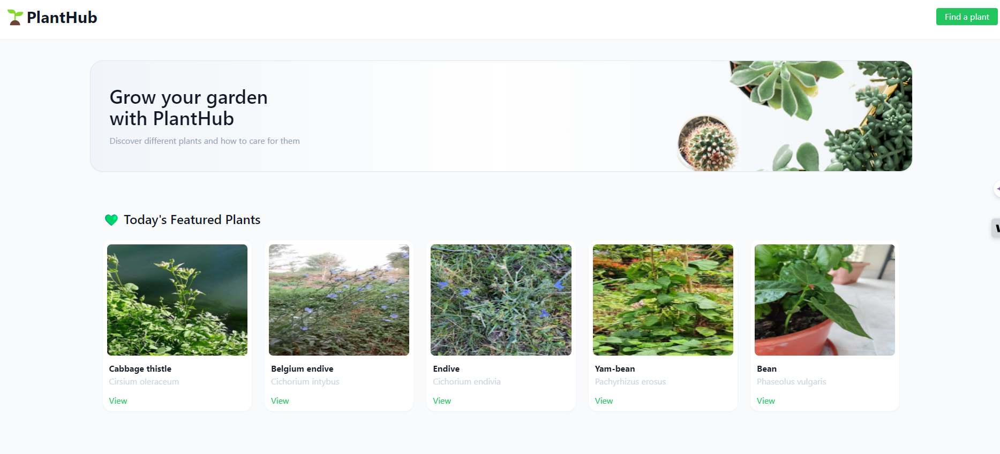
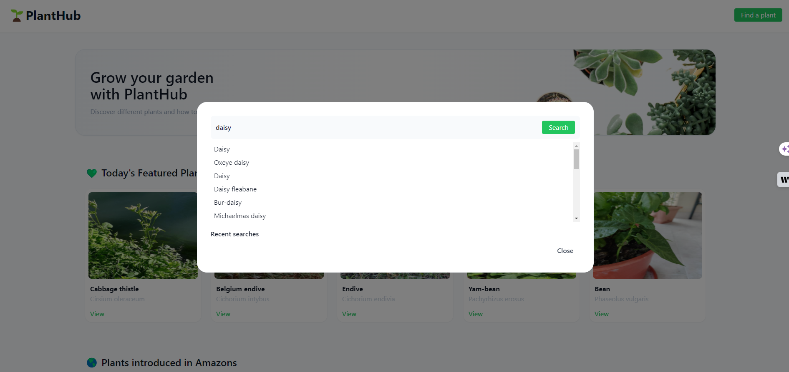

# PlantHub 🌱

## Description
PlantHub is a comprehensive we application designed for plant enthusiasts. This platform offers a robust search functionality, allowing users to explore a woide vairety of plants using filters. Each plant profile on PlantHub provides a detailed description, encompassing botanical information, care intructions, and interesting trivia to engage users. Additionally, the platform integrates external resources, including instructional YouTube videos on plant care, ensuring that users have access to reliable and practical advice. PlantHub employs Tailwaind CSS for a responsive and aestheically pleasing user interface, making the exploration of the botanical world both informative and enjoyable.

## User Story
As a user, I want to be able to search for different types of plants. I want to be able to search by plant name, kingdom type and more. On each plant profile, I want to be able to find a description of each plant and other fun facts. I also want to find external links, such as Youtube Videos, for best care practices.

## Contributing
Amandeep Sandhu,
Natalie Almosa,
Michelle Bell,
Abdulahi Mohamed,
Catherine Delaney

## API's Used
Plant API: https://trefle.io/

Youtube API: https://developers.google.com/youtube/v3

## UI Library
Tailwind: https://tailwindcss.com/

### Deployed Application 
[Deployed App Link](https://nalmosa.github.io/planthub/)

[GitHub](https://github.com/nalmosa/planthub?tab=readme-ov-file)

### Homepage 

### Search Page

### Plant Profile Page
